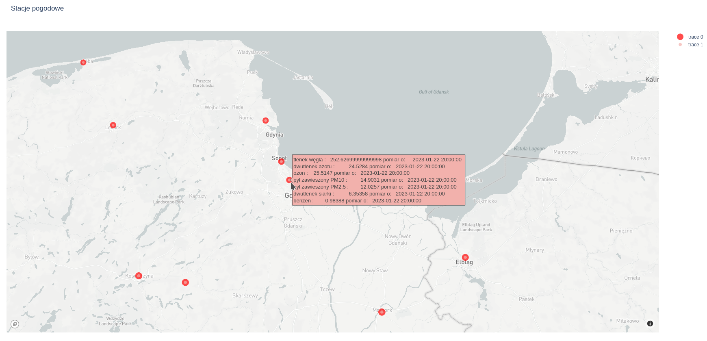

# Getting data via gov API from Polish air pollution stations with visualization on map

## Purpose
Learn API, learn how to visualize data on map.

## API source
Polish goverment (GIOŚ) run air pollution stations all over country and shares data over API.  
Documentation with instructions (in polish only, even if you choose EN) is available at [GIOŚ air pollution site - API](https://powietrze.gios.gov.pl/pjp/content/api?lang=en) 
As far as I look there's no limitation on how often you can use API. 

## Idea/ how it works

Structure of stations and sensors: 
`                                  +-------------+` 
`                                  |             |` 
`                              +-->| station[id] |` 
`                              |   |             |` 
`                              |   +------+------+` 
`                              |          |` 
`                              |          |  +------------+` 
`                              |          +->| sensor[id] |` 
`               +--------------+--+       |  +------------+` 
`               |                 |       |  +------------+` 
`               |      GIOŚ       |       +->| sensor[id] |` 
`               |                 |       |  +------------+` 
`               +--+-----------+--+       |  +------------+` 
`                  |           |          +->| sensor[id] |` 
`                  |           |             +------------+` 
`                  |           |` 
`+-------------+   |           |   +-------------+` 
`|             |   |           |   |             |` 
`| station[id] |<--+           +-->| station[id] |` 
`|             |                   |             |` 
`+------+------+                   +------+------+` 
`       |                                 |` 
`       |  +------------+                 |  +------------+` 
`       +->| sensor[id] |                 +->| sensor[id] |` 
`       |  +------------+                 |  +------------+` 
`       |  +------------+                 |  +------------+` 
`       +->| sensor[id] |                 +->| sensor[id] |` 
`       |  +------------+                 |  +------------+` 
`       |  +------------+                 |  +------------+` 
`       +->| sensor[id] |                 +->| sensor[id] |` 
`          +------------+                    +------------+` 
### getting data from API
First you need to get list of all (available) stations with: 
`https://api.gios.gov.pl/pjp-api/rest/station/findAll` 
as a result you will got json. 

next for each station id you need to take available sensors ids with: 
`https://api.gios.gov.pl/pjp-api/rest/station/sensors/{stationId}` 

each sensor must be asked for data: 
`https://api.gios.gov.pl/pjp-api/rest/data/getData/{sensorId}` 

### Visualization	
With Mapbox (which is free up to 50.000 views) and plotly, data then is showed in map. Each station has it's own coordinations and it's marked on map. When hoover over station, data popup.

### Current status
Script is working and shows data on map as minimal plan:
 
but it's quite slow at this moment, not sure if this is because script, or API is just slow

## Todo
[x] get data over API 
[x] structure data, so it can be used for visualisation 
[x] visualize data on map 
[ ] find why script is so slow (0.2s per sensor x number of stations) 
[ ] better visualization - colours as per level of pollution 
[ ] work on text tabulation
